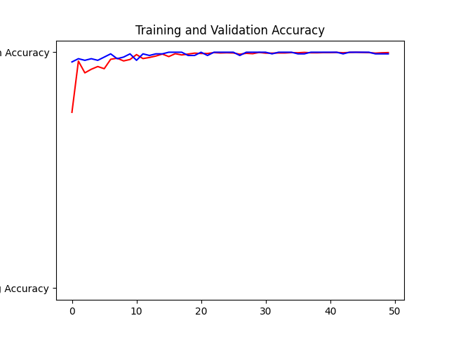
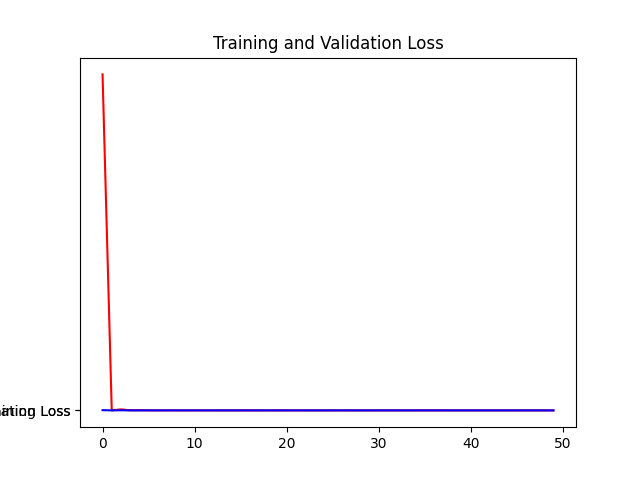
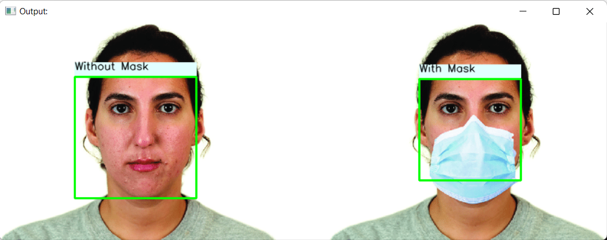

[](#read-me-template)
# Face Mask and Without Mask Classification


> Where There Is Python There Is A Way 😜

---

## **Table of Contents**
<!-- You're sections headers will be used to reference location of destination. -->

- [Description](#description)
- [How To Use](#how-to-use)
- [References](#references)
- [License](#license)
- [Author Info](#author-info)

---

## **Description**


This projects helps in classification whether a person is wearing mask or not.

<font size="4"> **Use cases of this project**</font>

The Base Network used is the famous MobileNetV2.Using transfer learning was able to train the model on less data and get a decent accuracy. Below are the result from the training.

**Model Accuracy**



**Model Loss**



You can get the dataset for this or your own model training on the following kaggle link

https://www.kaggle.com/datasets/andrewmvd/face-mask-detection

#### **Technologies**

- Python
- Tensorflow
- Jupyter Notebook


[Back To The Top](#read-me-template)

---

## **How To Use**

#### **Main Installation**

```html
    > git clone https://github.com/ReTrO19/Face_Mask_Classification.git
    > cd Face_Mask_Classification
    # using pip
    > pip install -r requirements.txt
    # using conda
    > conda env create -f environment.yml
    > conda activate <env_name>
```

#### **How to run the inference**
```html
    (Run jupyter notebook for train the model and check accuracy and whatnot)

    # For exploring the model run the below command

    # Running on image inference
    > python utils\image_inf.py -fc False -img test_images\demo.jpeg

    # Run a video inference
    > python utils\video_inf.py -fc False -vid test_images\video_file.mp4
```
---
## **Outputs**
#### ( Model is trained on 2 class with_mask and without_mask )
#### **Image Inference**
```html
 > python utils\image_inf.py -fc False -img test_images\mask_test1.png
```


[Back To The Top](#read-me-template)

---

## References

TensorFlow is a free and open-source software library for machine learning and artificial intelligence. It can be used across a range of tasks but has a particular focus on training and inference of deep neural. 
[Tensorflow](https://www.tensorflow.org/)

[Back To The Top](#read-me-template)

---

## License

MIT License

Copyright (c) [2021] [Abhishek Khamkar]

Permission is hereby granted, free of charge, to any person obtaining a copy
of this software and associated documentation files (the "Software"), to deal
in the Software without restriction, including without limitation the rights
to use, copy, modify, merge, publish, distribute, sublicense, and/or sell
copies of the Software, and to permit persons to whom the Software is
furnished to do so, subject to the following conditions:

The above copyright notice and this permission notice shall be included in all
copies or substantial portions of the Software.

THE SOFTWARE IS PROVIDED "AS IS", WITHOUT WARRANTY OF ANY KIND, EXPRESS OR
IMPLIED, INCLUDING BUT NOT LIMITED TO THE WARRANTIES OF MERCHANTABILITY,
FITNESS FOR A PARTICULAR PURPOSE AND NONINFRINGEMENT. IN NO EVENT SHALL THE
AUTHORS OR COPYRIGHT HOLDERS BE LIABLE FOR ANY CLAIM, DAMAGES OR OTHER
LIABILITY, WHETHER IN AN ACTION OF CONTRACT, TORT OR OTHERWISE, ARISING FROM,
OUT OF OR IN CONNECTION WITH THE SOFTWARE OR THE USE OR OTHER DEALINGS IN THE
SOFTWARE.

[Back To The Top](#read-me-template)

---

## Author Info

- LinkedIn - [Abhishek Khamkar](https://www.linkedin.com/in/abhishek-khamkar-b30756185)


[Back To The Top](#read-me-template)
